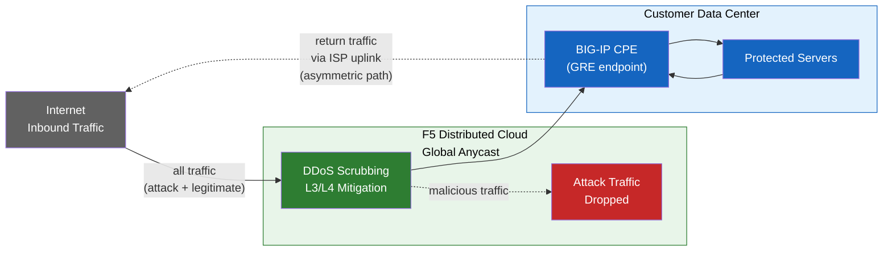
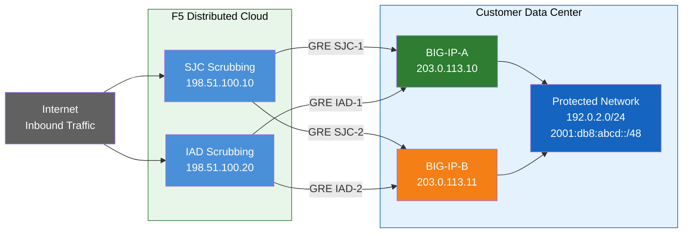
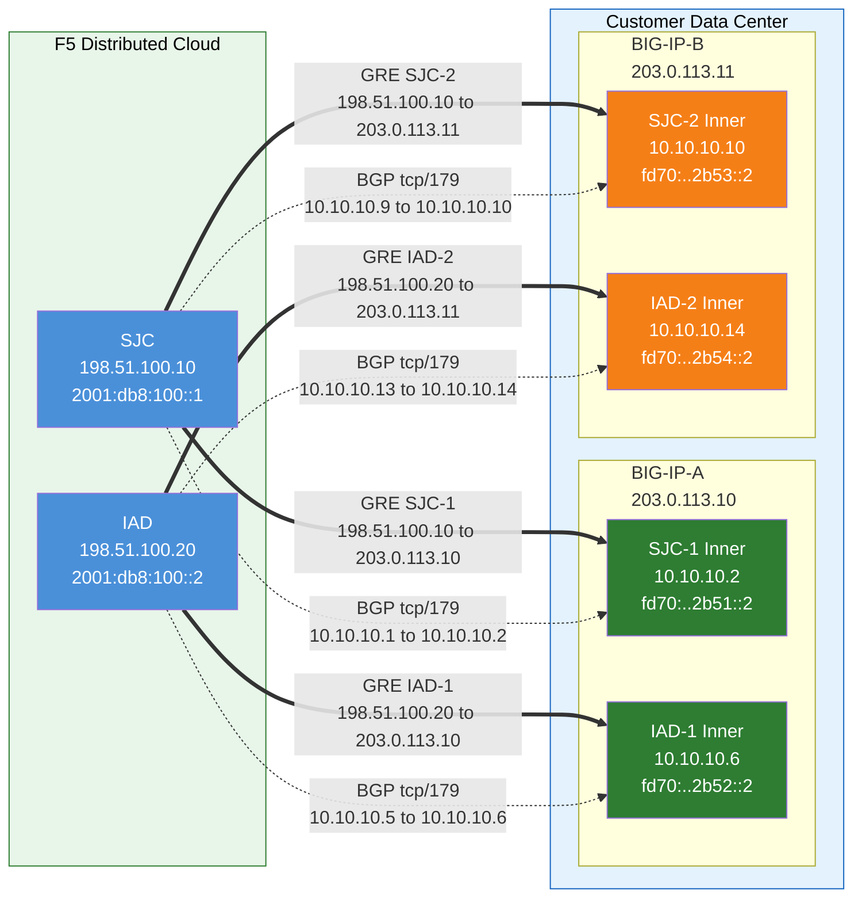
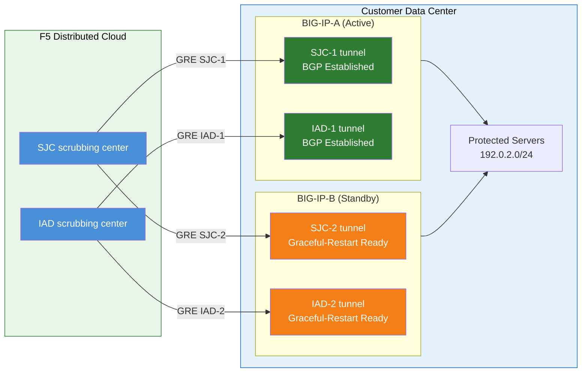

# F5 Distributed Cloud DDoS mitigation (routed mode) with GRE and BGP from BIG-IP

## Purpose

This guide explains how to:

- Configure **GRE tunnels** and **BGP peering** from a BIG-IP HA pair
  (acting as customer premises equipment, CPE), with independent
  tunnels per unit.
- Connect to the **F5 Distributed Cloud DDoS Mitigation** scrubbing
  centers in **routed mode** (L3/L4).

If you are **not using BIG-IP for GRE tunnels**, use standard GRE
setup on your router/CPE, and follow the F5 Distributed Cloud guide
for tunnel and BGP configuration in the Console.



## Environment

- F5 Distributed Cloud **L3/L4 Routed DDoS Mitigation** service
  (Always On or Always Available) enabled for your tenant.
- BIG-IP with:
  - LTM (or equivalent networking modules).
  - **Dynamic routing (BGP)** licensed and enabled.
- Routed mode: at least one **publicly advertised /24 (or shorter)**
  prefix for protection (IPv6 minimum is **/48**).
  - Protected prefixes **must be publicly routable** (non-RFC 1918).
    GRE outer endpoints must also be publicly routable when tunnels
    traverse the public Internet; deployments using private
    connectivity (L2, private peering) may use RFC 1918 endpoint
    addresses.
- Connectivity between your data center/router and the F5 Distributed
  Cloud scrubbing center(s).

## Key concepts

### Route domains

A **route domain** is a logical routing table on BIG-IP that:

- Isolates network traffic for a particular application/tenant.
- Allows re-use of overlapping IP addresses in different route
  domains.
- Is identified by a numeric Route Domain ID (for example, 0, 1) and
  referenced as `IP%ID`.

This guide assumes **Route Domain 0** (the default).

### VLANs and tunnels

- You can assign one or more **VLANs** or **tunnels** to a route
  domain.
- Each VLAN/tunnel can belong to **only one** route domain.
- GRE tunnels used for F5 Distributed Cloud are treated like VLAN
  objects on BIG-IP.

### Dynamic routing (BGP)

- For each route domain, you can enable dynamic routing protocols
  such as **BGP**.
- BGP in this design:
  - Establishes a peering session between BIG-IP and F5 Distributed
    Cloud.
  - Advertises customer prefixes that should be protected.
  - Receives routes for return (clean) traffic.

## Sample topology and addresses

> **These are example values.** Replace with customer-specific and
> F5-provided values.
>
> Protected prefixes **must be publicly routable** (non-RFC 1918).
> GRE outer endpoint IPs must also be publicly routable when tunnels
> traverse the public Internet; private connectivity (L2, private
> peering) may allow RFC 1918 endpoints. See
> [K000147949][k000147949] for examples using proper documentation
> addresses.
>
> For redundancy, create **2 tunnels per BIG-IP unit** to different
> geo-located F5 scrubbing centers (4 tunnels total for an HA pair).



### F5 Distributed Cloud (scrubbing center) sample

**Tunnel SJC-1 — SJC to BIG-IP-A:**

- GRE outer IPs (for tunnel endpoints):
  - IPv4 SRC: `198.51.100.10/24`
  - IPv4 DST: `203.0.113.10/24`
  - IPv6 SRC: `2001:db8:100::1/64`
  - IPv6 DST: `2001:db8:200::1/64`
- GRE inner IPs (for BGP session):
  - IPv4: `10.10.10.1/30`
  - IPv6: `fd70:b364:3528:2b51::1/64`

**Tunnel SJC-2 — SJC to BIG-IP-B:**

- GRE outer IPs (for tunnel endpoints):
  - IPv4 SRC: `198.51.100.10/24`
  - IPv4 DST: `203.0.113.11/24`
  - IPv6 SRC: `2001:db8:100::1/64`
  - IPv6 DST: `2001:db8:200::2/64`
- GRE inner IPs (for BGP session):
  - IPv4: `10.10.10.9/30`
  - IPv6: `fd70:b364:3528:2b53::1/64`

**Tunnel IAD-1 — IAD to BIG-IP-A:**

- GRE outer IPs (for tunnel endpoints):
  - IPv4 SRC: `198.51.100.20/24`
  - IPv4 DST: `203.0.113.10/24`
  - IPv6 SRC: `2001:db8:100::2/64`
  - IPv6 DST: `2001:db8:200::1/64`
- GRE inner IPs (for BGP session):
  - IPv4: `10.10.10.5/30`
  - IPv6: `fd70:b364:3528:2b52::1/64`

**Tunnel IAD-2 — IAD to BIG-IP-B:**

- GRE outer IPs (for tunnel endpoints):
  - IPv4 SRC: `198.51.100.20/24`
  - IPv4 DST: `203.0.113.11/24`
  - IPv6 SRC: `2001:db8:100::2/64`
  - IPv6 DST: `2001:db8:200::2/64`
- GRE inner IPs (for BGP session):
  - IPv4: `10.10.10.13/30`
  - IPv6: `fd70:b364:3528:2b54::1/64`

> **Inner (transit) IPs** such as `10.10.10.0/30` use RFC 1918
> addresses. This is correct because they are encapsulated inside the
> GRE tunnel and never appear on the public Internet. Protected
> prefixes must always be publicly routable; outer endpoint IPs must
> be publicly routable when tunnels traverse the public Internet.

> **IPv6 inner links** use /64 prefixes here to match common F5
> Distributed Cloud defaults. For point-to-point links, /127 is
> preferred per [RFC 6164][rfc6164] to avoid neighbor-discovery
> exhaustion. Use /127 if your F5 SOC tunnel assignment supports it.

### Customer / BIG-IP sample

**BIG-IP-A** (outer IP `203.0.113.10` / `2001:db8:200::1`):

- GRE outer IPs:
  - IPv4 SRC: `203.0.113.10/24`
  - IPv4 DST (SJC): `198.51.100.10/24`
  - IPv4 DST (IAD): `198.51.100.20/24`
  - IPv6 SRC: `2001:db8:200::1/64`
  - IPv6 DST (SJC): `2001:db8:100::1/64`
  - IPv6 DST (IAD): `2001:db8:100::2/64`
- GRE inner IPs — Tunnel SJC-1:
  - IPv4: `10.10.10.2/30`
  - IPv6: `fd70:b364:3528:2b51::2/64`
- GRE inner IPs — Tunnel IAD-1:
  - IPv4: `10.10.10.6/30`
  - IPv6: `fd70:b364:3528:2b52::2/64`

**BIG-IP-B** (outer IP `203.0.113.11` / `2001:db8:200::2`):

- GRE outer IPs:
  - IPv4 SRC: `203.0.113.11/24`
  - IPv4 DST (SJC): `198.51.100.10/24`
  - IPv4 DST (IAD): `198.51.100.20/24`
  - IPv6 SRC: `2001:db8:200::2/64`
  - IPv6 DST (SJC): `2001:db8:100::1/64`
  - IPv6 DST (IAD): `2001:db8:100::2/64`
- GRE inner IPs — Tunnel SJC-2:
  - IPv4: `10.10.10.10/30`
  - IPv6: `fd70:b364:3528:2b53::2/64`
- GRE inner IPs — Tunnel IAD-2:
  - IPv4: `10.10.10.14/30`
  - IPv6: `fd70:b364:3528:2b54::2/64`

- Protected prefixes (advertised to F5 Distributed Cloud):
  - IPv4: `192.0.2.0/24`
  - IPv6: `2001:db8:abcd::/48`



## F5 Distributed Cloud configuration (Console)

This section summarizes the **F5 Distributed Cloud** side, based on
the [L3/L4 Routed DDoS Mitigation][xc-ddos-guide] guide.

### Enable the DDoS mitigation workspace

Before you can configure tunnels and BGP:

1. Contact the F5 Distributed Cloud team (via `sales@cloud.f5.com`
   or your F5 account team) to:
   - Enable **Routed DDoS Mitigation** workspace for your tenant.
   - Provide:
     - Your **public IP netblocks** (/24 or shorter for IPv4, /48 or
       shorter for IPv6) and proof of ownership (or LOA).
     - Your **ASN** (must be issued by ARIN or equivalent registry).
     - **IRR** registration (RIPE, ARIN, APNIC, etc.) and **ROA** in
       RPKI repository.
     - Desired **clean-traffic return method** (GRE tunnels, Layer 2,
       private peering via Equinix, etc.).
     - Data center locations and routers to protect.
     - **AS-Path prepends** required for route announcements.
     - Any **BGP communities**, route preferences, or **AS-SET**
       (optional).

1. F5 SOC will provision:
   - Tunnels
   - ASNs
   - Protected prefixes
   - Route advertisement options
   - Fast ACLs / firewall policies, as needed

### Configure tunnels in Console

1. Log in to the [F5 Distributed Cloud Console][xc-ddos-guide] and
   select **Routed DDoS** from the service selector.
1. Go to **Manage > Tunnels > Add Tunnel**.
1. Set:
   - **Location Name** and **Availability Zone** (Zone 1 by default).
   - **Bandwidth Max in MB**.
   - **Tunnel Type**:
     - **GRE Over IPv4** for IPv4 outer tunnel.
     - **GRE Over IPv6** for IPv6 outer tunnel.
     - **IP Over IP** for IPv4-in-IPv4 encapsulation.
     - **IPv6 Over IPv6** for IPv6-in-IPv6 encapsulation.
   - **Customer Endpoint IP**: BIG-IP's external address (outer self
     IP, must be publicly routable when tunnels traverse the public
     Internet).
   - Optional: IPv4/IPv6 interconnect, fragmentation, keepalive (all
     disabled by default).
1. Under **Tunnel BGP Information**:
   - Select an **ASN object** (your ASN).
   - Set **Customer Peer Secret Override**: Use Default Secret
     (default), BGP Password Override (blindfolded or clear text), or
     No Secret.
   - Set **Holddown Timer** value in seconds if different from
     default.

F5 SOC may pre-create these tunnel objects for you; you simply match
the **endpoint IPs** and BGP settings on BIG-IP.

### Configure ASNs, prefixes, and route advertisements

- **ASNs**:
  - **Manage > ASNs > Add ASN**.
  - Enter your ASN and ensure BGP is enabled.
- **Prefixes**:
  - **Manage > Prefixes > Add Prefix**.
  - Enter each IP prefix and associate it with your ASN.
- **Route Advertisements**:
  - **Manage > Route Advertisement > Add Route Advertisement**.
  - Enter prefix, choose **Active** or **Not Advertised**, and
    optional expiration.

These objects control which prefixes are announced via F5's global
network when the service is active.

### Optional: network firewall, deny lists, and Fast ACLs

**Firewall Rules**, **Deny List Rules**, and **Fast ACLs for Internet
VIPs** let you:

- Block or allow specific traffic.
- Rate-limit abusive sources.
- Apply additional DDoS protections beyond pure volumetric scrubbing.

## BIG-IP configuration (Route Domain 0 example)

All commands below are run in **tmsh** on BIG-IP. Adjust object names
and IPs as needed.

For general GRE tunnel configuration on BIG-IP, see
[Configuring a GRE Tunnel Using BIG-IP][gre-devcentral]. For initial
routed configuration setup with F5 XC, see [K000147949][k000147949].

### Open tmsh

```bash
[root@bigip:Active]# tmsh
root@(bigip)(cfg-sync Standalone)(Active)(/Common)(tmos)#
```

### Configure outer self IPs (GRE endpoints)

These are the IPs on each BIG-IP unit used as **GRE tunnel
endpoints**, typically on the external VLAN. Each unit has its own
non-floating outer self IP (`traffic-group-local-only`):

**BIG-IP-A:**

```shell
create net self xc-ddos-v4-self-a \
  vlan external \
  traffic-group traffic-group-local-only \
  allow-service add { icmp:any gre:any } \
  address 203.0.113.10/24

create net self xc-ddos-v6-self-a \
  vlan external \
  traffic-group traffic-group-local-only \
  allow-service add { icmp:any gre:any } \
  address 2001:db8:200::1/64
```

**BIG-IP-B:**

```shell
create net self xc-ddos-v4-self-b \
  vlan external \
  traffic-group traffic-group-local-only \
  allow-service add { icmp:any gre:any } \
  address 203.0.113.11/24

create net self xc-ddos-v6-self-b \
  vlan external \
  traffic-group traffic-group-local-only \
  allow-service add { icmp:any gre:any } \
  address 2001:db8:200::2/64
```

### Create GRE tunnels

Each tunnel points from a BIG-IP unit to an F5 Distributed Cloud
scrubbing center endpoint. Create **two tunnels per unit** (one to
each geo-located scrubbing center) for a total of **four logical
tunnels** across the HA pair:

**Tunnel SJC-1 — BIG-IP-A to SJC (San Jose):**

```shell
create net tunnels tunnel xc-ddos-sjc1-v4 \
  local-address 203.0.113.10 \
  profile gre \
  remote-address 198.51.100.10

create net tunnels tunnel xc-ddos-sjc1-v6 \
  local-address 2001:db8:200::1 \
  profile gre \
  remote-address 2001:db8:100::1
```

**Tunnel IAD-1 — BIG-IP-A to IAD (Ashburn):**

```shell
create net tunnels tunnel xc-ddos-iad1-v4 \
  local-address 203.0.113.10 \
  profile gre \
  remote-address 198.51.100.20

create net tunnels tunnel xc-ddos-iad1-v6 \
  local-address 2001:db8:200::1 \
  profile gre \
  remote-address 2001:db8:100::2
```

**Tunnel SJC-2 — BIG-IP-B to SJC (San Jose):**

```shell
create net tunnels tunnel xc-ddos-sjc2-v4 \
  local-address 203.0.113.11 \
  profile gre \
  remote-address 198.51.100.10

create net tunnels tunnel xc-ddos-sjc2-v6 \
  local-address 2001:db8:200::2 \
  profile gre \
  remote-address 2001:db8:100::1
```

**Tunnel IAD-2 — BIG-IP-B to IAD (Ashburn):**

```shell
create net tunnels tunnel xc-ddos-iad2-v4 \
  local-address 203.0.113.11 \
  profile gre \
  remote-address 198.51.100.20

create net tunnels tunnel xc-ddos-iad2-v6 \
  local-address 2001:db8:200::2 \
  profile gre \
  remote-address 2001:db8:100::2
```

Tunnel names (`xc-ddos-sjc1-v4`, etc.) are arbitrary; use your own
naming convention.

### Set tunnel MTU

GRE encapsulation adds overhead (24 bytes for IPv4 outer, 44 bytes
for IPv6 outer). Without an explicit MTU, packets near 1500 bytes
will fragment or be dropped. Set the tunnel MTU to account for
encapsulation overhead:

```shell
modify net tunnels tunnel xc-ddos-sjc1-v4 mtu 1476
modify net tunnels tunnel xc-ddos-sjc1-v6 mtu 1456
modify net tunnels tunnel xc-ddos-sjc2-v4 mtu 1476
modify net tunnels tunnel xc-ddos-sjc2-v6 mtu 1456
modify net tunnels tunnel xc-ddos-iad1-v4 mtu 1476
modify net tunnels tunnel xc-ddos-iad1-v6 mtu 1456
modify net tunnels tunnel xc-ddos-iad2-v4 mtu 1476
modify net tunnels tunnel xc-ddos-iad2-v6 mtu 1456
```

> The values above assume a 1500-byte path MTU on the outer network.
> Adjust if your upstream path MTU is smaller. Ensure ICMP
> "destination unreachable / fragmentation needed" (type 3, code 4)
> is **not** blocked on any intermediate device so that Path MTU
> Discovery (PMTUD) functions correctly.

### GRE anti-spoofing (upstream ACLs)

GRE (IP protocol 47) does not provide authentication. Anyone who
knows the outer IP pair can inject traffic into the tunnel. Apply
ACLs on the upstream router or firewall to restrict inbound GRE to
only the expected F5 scrubbing-center source IPs:

```text
! Example upstream router ACL (Cisco IOS style)
ip access-list extended ALLOW-XC-GRE
  permit gre host 198.51.100.10 host 203.0.113.10
  permit gre host 198.51.100.20 host 203.0.113.10
  permit gre host 198.51.100.10 host 203.0.113.11
  permit gre host 198.51.100.20 host 203.0.113.11
  deny   gre any host 203.0.113.10 log
  deny   gre any host 203.0.113.11 log
```

> Adapt the syntax for your router platform. The same principle
> applies to IPv6 ACLs for the IPv6 GRE tunnels. Both BIG-IP-A
> (`203.0.113.10`) and BIG-IP-B (`203.0.113.11`) outer IPs must be
> permitted as GRE destinations.

### Configure inner self IPs (BGP peering)

Assign inner IP addresses (inside the GRE tunnel) that will form the
**BGP session** with F5 Distributed Cloud. The `allow-service` must
include `tcp:179` (BGP) for the peering session to establish. Adding
`icmp:any` on the inner self IPs enables PMTUD and reachability
testing through the tunnel:

**Tunnel SJC-1 — BIG-IP-A to SJC:**

```shell
create net self xc-ddos-sjc1-inner-v4 \
  vlan xc-ddos-sjc1-v4 \
  traffic-group traffic-group-local-only \
  allow-service add { tcp:179 icmp:any } \
  address 10.10.10.2/30

create net self xc-ddos-sjc1-inner-v6 \
  vlan xc-ddos-sjc1-v6 \
  traffic-group traffic-group-local-only \
  allow-service add { tcp:179 icmp:any } \
  address fd70:b364:3528:2b51::2/64
```

**Tunnel IAD-1 — BIG-IP-A to IAD:**

```shell
create net self xc-ddos-iad1-inner-v4 \
  vlan xc-ddos-iad1-v4 \
  traffic-group traffic-group-local-only \
  allow-service add { tcp:179 icmp:any } \
  address 10.10.10.6/30

create net self xc-ddos-iad1-inner-v6 \
  vlan xc-ddos-iad1-v6 \
  traffic-group traffic-group-local-only \
  allow-service add { tcp:179 icmp:any } \
  address fd70:b364:3528:2b52::2/64
```

**Tunnel SJC-2 — BIG-IP-B to SJC:**

```shell
create net self xc-ddos-sjc2-inner-v4 \
  vlan xc-ddos-sjc2-v4 \
  traffic-group traffic-group-local-only \
  allow-service add { tcp:179 icmp:any } \
  address 10.10.10.10/30

create net self xc-ddos-sjc2-inner-v6 \
  vlan xc-ddos-sjc2-v6 \
  traffic-group traffic-group-local-only \
  allow-service add { tcp:179 icmp:any } \
  address fd70:b364:3528:2b53::2/64
```

**Tunnel IAD-2 — BIG-IP-B to IAD:**

```shell
create net self xc-ddos-iad2-inner-v4 \
  vlan xc-ddos-iad2-v4 \
  traffic-group traffic-group-local-only \
  allow-service add { tcp:179 icmp:any } \
  address 10.10.10.14/30

create net self xc-ddos-iad2-inner-v6 \
  vlan xc-ddos-iad2-v6 \
  traffic-group traffic-group-local-only \
  allow-service add { tcp:179 icmp:any } \
  address fd70:b364:3528:2b54::2/64
```

### Verify dynamic routing (BGP) is licensed

You must have **dynamic routing** licensed on BIG-IP. If you do not
see BGP options, contact your F5 account team to enable the feature.

### Configure BGP in Route Domain 0

Use [imish][imish-docs] to configure BGP for Route Domain 0.

> **Per-unit configuration**: The `imish` BGP configuration is local
> to each BIG-IP unit. Each unit only configures neighbors for its
> own tunnels:
>
> - **BIG-IP-A** configures SJC-1 and IAD-1 neighbors.
> - **BIG-IP-B** configures SJC-2 and IAD-2 neighbors.
>
> The `router-id` must be unique per unit (use each unit's own outer
> self IP).

1. Enter imish for RD 0:

   ```bash
   tmsh run /util imish -r 0
   ```

1. Enter privileged and config mode:

   ```text
   localhost.localdomain[0]> enable
   localhost.localdomain[0]# configure terminal
   ```

1. Example BGP configuration:

> Replace the following values:
>
> - `<YOUR_PUBLIC_ASN>` with your public ASN registered with ARIN (or
>   equivalent RIR). A **public ASN is required** for routed DDoS
>   because F5 Distributed Cloud will announce your prefixes globally.
>   A private ASN (64512-65534 / 4200000000-4294967294) is only
>   acceptable if F5 SOC explicitly supports private-ASN peering for
>   your deployment.
> - `<F5_XC_ASN>` with F5's ASN (provided by the SOC).
> - IPs/prefixes with your real values.
> - `<BGP_MD5_PASSWORD>` with the agreed BGP MD5 password (or match
>   Console "default secret"). Never reuse this password for other
>   services.

**BIG-IP-A** (router-id `203.0.113.10`, neighbors SJC-1 + IAD-1):

```text
router bgp <YOUR_PUBLIC_ASN>
  no synchronization
  bgp log-neighbor-changes
  no auto-summary
  bgp router-id 203.0.113.10
  bgp graceful-restart restart-time 120
  redistribute kernel route-map route-to-f5-ipv4

  neighbor f5xc peer-group
  neighbor f5xc remote-as <F5_XC_ASN>
  neighbor f5xc description f5xc-peer-group
  neighbor f5xc password <BGP_MD5_PASSWORD>
  neighbor f5xc timers 10 30
  neighbor f5xc soft-reconfiguration inbound
  neighbor f5xc version 4
  neighbor f5xc capability graceful-restart
  neighbor f5xc send-community
  neighbor f5xc ttl-security hops 1
  neighbor f5xc maximum-prefix 10 warning-only
  neighbor f5xc prefix-list deny-all in
  neighbor f5xc prefix-list route-to-f5-ipv4 out

  neighbor 10.10.10.1 peer-group f5xc
  neighbor 10.10.10.1 description f5xc-sjc1-v4

  neighbor 10.10.10.5 peer-group f5xc
  neighbor 10.10.10.5 description f5xc-iad1-v4

  address-family ipv6
    redistribute kernel route-map route-to-f5-ipv6
    neighbor f5xc activate
    neighbor f5xc soft-reconfiguration inbound
    neighbor f5xc capability graceful-restart
    neighbor f5xc prefix-list deny-all6 in
    neighbor f5xc prefix-list route-to-f5-ipv6 out
    neighbor fd70:b364:3528:2b51::1 peer-group f5xc
    neighbor fd70:b364:3528:2b51::1 description f5xc-sjc1-v6
    neighbor fd70:b364:3528:2b52::1 peer-group f5xc
    neighbor fd70:b364:3528:2b52::1 description f5xc-iad1-v6
  exit-address-family

ip prefix-list deny-all deny 0.0.0.0/0 le 32
ip prefix-list route-to-f5-ipv4 permit 192.0.2.0/24

ipv6 prefix-list deny-all6 deny ::/0 le 128
ipv6 prefix-list route-to-f5-ipv6 permit 2001:db8:abcd::/48

ip route 192.0.2.0 255.255.255.0 null0 201
ipv6 route 2001:db8:abcd::/48 null0 201

route-map route-to-f5-ipv4 permit 10
  match ip address prefix-list route-to-f5-ipv4
  set origin igp

route-map route-to-f5-ipv6 permit 10
  match ipv6 address prefix-list route-to-f5-ipv6
  set origin igp
```

**BIG-IP-B** (router-id `203.0.113.11`, neighbors SJC-2 + IAD-2):

```text
router bgp <YOUR_PUBLIC_ASN>
  no synchronization
  bgp log-neighbor-changes
  no auto-summary
  bgp router-id 203.0.113.11
  bgp graceful-restart restart-time 120
  redistribute kernel route-map route-to-f5-ipv4

  neighbor f5xc peer-group
  neighbor f5xc remote-as <F5_XC_ASN>
  neighbor f5xc description f5xc-peer-group
  neighbor f5xc password <BGP_MD5_PASSWORD>
  neighbor f5xc timers 10 30
  neighbor f5xc soft-reconfiguration inbound
  neighbor f5xc version 4
  neighbor f5xc capability graceful-restart
  neighbor f5xc send-community
  neighbor f5xc ttl-security hops 1
  neighbor f5xc maximum-prefix 10 warning-only
  neighbor f5xc prefix-list deny-all in
  neighbor f5xc prefix-list route-to-f5-ipv4 out

  neighbor 10.10.10.9 peer-group f5xc
  neighbor 10.10.10.9 description f5xc-sjc2-v4

  neighbor 10.10.10.13 peer-group f5xc
  neighbor 10.10.10.13 description f5xc-iad2-v4

  address-family ipv6
    redistribute kernel route-map route-to-f5-ipv6
    neighbor f5xc activate
    neighbor f5xc soft-reconfiguration inbound
    neighbor f5xc capability graceful-restart
    neighbor f5xc prefix-list deny-all6 in
    neighbor f5xc prefix-list route-to-f5-ipv6 out
    neighbor fd70:b364:3528:2b53::1 peer-group f5xc
    neighbor fd70:b364:3528:2b53::1 description f5xc-sjc2-v6
    neighbor fd70:b364:3528:2b54::1 peer-group f5xc
    neighbor fd70:b364:3528:2b54::1 description f5xc-iad2-v6
  exit-address-family

ip prefix-list deny-all deny 0.0.0.0/0 le 32
ip prefix-list route-to-f5-ipv4 permit 192.0.2.0/24

ipv6 prefix-list deny-all6 deny ::/0 le 128
ipv6 prefix-list route-to-f5-ipv6 permit 2001:db8:abcd::/48

ip route 192.0.2.0 255.255.255.0 null0 201
ipv6 route 2001:db8:abcd::/48 null0 201

route-map route-to-f5-ipv4 permit 10
  match ip address prefix-list route-to-f5-ipv4
  set origin igp

route-map route-to-f5-ipv6 permit 10
  match ipv6 address prefix-list route-to-f5-ipv6
  set origin igp
```

**Key BGP settings explained:**

- **`timers 10 30`** — Keepalive every 10 s, hold time 30 s. The
  default (60 / 180) is too slow for DDoS mitigation failover.
  Coordinate timer values with F5 SOC to match both sides.
- **`ttl-security hops 1`** — Enables GTSM
  ([RFC 5082][rfc5082]). Because the BGP sessions are single-hop
  over the GRE tunnel, this prevents remote BGP spoofing by
  requiring TTL = 255 on incoming BGP packets.
- **`maximum-prefix 10 warning-only`** — Defence-in-depth safeguard.
  Even though the inbound prefix-list denies all routes, this
  generates a warning if the peer unexpectedly sends prefixes.
- **`redistribute kernel`** — Injects the `null0` static routes into
  BGP via the route-map. An alternative is to use explicit `network`
  statements (e.g. `network 192.0.2.0/24`), which are more precise
  because only the exact prefix is advertised regardless of other
  kernel routes. Either approach works; `redistribute kernel` with a
  strict route-map is shown here for flexibility.

> **BFD (Bidirectional Forwarding Detection):** If your BIG-IP
> version supports BFD over GRE tunnels, enable it for sub-second
> failure detection:
>
> ```text
> neighbor f5xc fall-over bfd
> ```
>
> BFD provides faster convergence than BGP keepalive timers alone.
> Confirm BFD support with your BIG-IP version and F5 SOC before
> enabling.

The `null0` static routes with higher administrative distance (201)
ensure the prefixes exist in the **kernel routing table**, so they can
be redistributed to F5 Distributed Cloud via BGP without affecting
normal routing under non-attack conditions. If the protected prefix
already exists in the routing table from another source with a lower
administrative distance, the `null0` route will not be active and
redistribution may fail — verify with `show ip route` after
configuration.

## Validation and troubleshooting

### On BIG-IP

Verify tunnels and MTU (run on each unit for its own tunnels):

```shell
show net tunnels tunnel xc-ddos-sjc1-v4
show net tunnels tunnel xc-ddos-sjc1-v6
show net tunnels tunnel xc-ddos-sjc2-v4
show net tunnels tunnel xc-ddos-sjc2-v6
show net tunnels tunnel xc-ddos-iad1-v4
show net tunnels tunnel xc-ddos-iad1-v6
show net tunnels tunnel xc-ddos-iad2-v4
show net tunnels tunnel xc-ddos-iad2-v6
list net tunnels tunnel xc-ddos-sjc1-v4 all-properties
```

Verify self IPs:

```shell
list net self xc-ddos-*
```

Test reachability through the tunnel (from each unit):

```shell
# BIG-IP-A tunnels
ping 10.10.10.1 source 10.10.10.2
ping 10.10.10.5 source 10.10.10.6

# BIG-IP-B tunnels
ping 10.10.10.9 source 10.10.10.10
ping 10.10.10.13 source 10.10.10.14
```

Verify BGP (in imish on each unit):

```text
show ip bgp summary
show ipv6 bgp summary
show ip bgp
show ipv6 bgp

# BIG-IP-A neighbors
show ip bgp neighbors 10.10.10.1
show ip bgp neighbors 10.10.10.5
show ip bgp neighbors 10.10.10.1 advertised-routes
show ip bgp neighbors 10.10.10.1 received-routes

# BIG-IP-B neighbors
show ip bgp neighbors 10.10.10.9
show ip bgp neighbors 10.10.10.13
show ip bgp neighbors 10.10.10.9 advertised-routes
show ip bgp neighbors 10.10.10.9 received-routes

show ip route
show ipv6 route
```

> **Troubleshooting checklist** if BGP does not establish:
>
> 1. Verify the GRE tunnel is up: `show net tunnels tunnel` should
>    show state `up`.
> 2. Confirm `allow-service` includes `tcp:179` on the inner self IP.
> 3. Ping the remote inner IP through the tunnel.
> 4. Check BGP password matches on both sides (common cause of
>    `NOTIFICATION` errors).
> 5. Verify prefix-lists and route-maps are applied correctly.
> 6. Check `show ip bgp neighbors <IP>` for the last error/reset
>    reason.
> 7. On each HA unit, verify the unit's own tunnels are up and its
>    own BGP neighbors are configured (not the other unit's).

### On F5 Distributed Cloud Console

Go to **DDoS and Transit Services >
[DDoS Protection > Visibility][xc-ddos-guide]** to see:

- Traffic by network, zone, application.
- Blocked vs. allowed traffic.
- Attack details and scrubbing actions.

## BIG-IP HA pair considerations

If BIG-IP is deployed as an **active/standby HA pair**, each unit
gets its own independent GRE tunnels and BGP sessions to every
scrubbing center:



- **Independent tunnel endpoints**: Each BIG-IP unit has its own
  non-floating outer self IP (`traffic-group-local-only`) and its
  own set of GRE tunnels. BIG-IP-A uses `203.0.113.10` and
  BIG-IP-B uses `203.0.113.11` as tunnel endpoints. This avoids
  dependence on a floating IP for tunnel sourcing.
- **Independent BGP sessions**: Each unit runs its own BGP sessions
  over its own tunnels. BIG-IP-A peers with SJC-1 and IAD-1;
  BIG-IP-B peers with SJC-2 and IAD-2. On failover the standby
  unit's BGP sessions are already established, so F5 Distributed
  Cloud can shift traffic immediately.
- **Config sync**: Tunnel, self IP, and routing configurations are
  synced between units via **config-sync**. Because the `imish`
  BGP configuration is per-unit, each unit maintains its own
  neighbor statements. Verify sync includes all tmsh objects.
- **Active/standby BGP behavior**: The active unit advertises
  protected prefixes with normal BGP attributes. The standby unit
  can either advertise the same prefixes with a longer AS-path
  prepend (making it less preferred) or suppress advertisements
  until failover. Coordinate the approach with F5 SOC.
- **Failover convergence**: With `graceful-restart` enabled and
  independent tunnels, the new active unit already has established
  BGP sessions. Convergence depends on BGP best-path selection
  shifting to the newly active unit's advertisements. Test with
  `run sys failover standby`.

> The independent-tunnel HA model above is the recommended approach
> for customer-side device redundancy. Validate your specific
> failover design with your F5 account team before going to
> production, particularly around AS-path prepend strategy and BGP
> reconvergence timing.

<!-- Reference links -->

[xc-ddos-guide]: https://docs.cloud.f5.com/docs-v2/ddos-and-transit-services/how-tos/network-firewall/l3l4-ddos-mitigation
[k000147949]: https://my.f5.com/manage/s/article/K000147949
[gre-devcentral]: https://community.f5.com/kb/technicalarticles/configuring-a-generic-routing-encapsulation-gre-tunnel-using-big-ip/289030
[imish-docs]: https://techdocs.f5.com/kb/en-us/products/big-ip_ltm/manuals/product/big-ip-tmos-routing-administration-14-0-0/11.html
[rfc5082]: https://datatracker.ietf.org/doc/html/rfc5082
[rfc6164]: https://datatracker.ietf.org/doc/html/rfc6164
