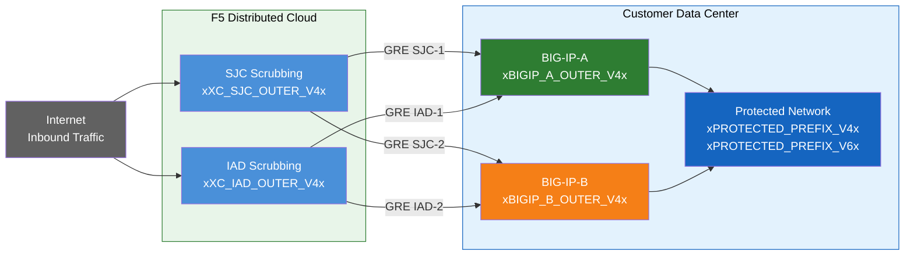

# Environment & Topology

!!! tip "Enter your values"
    Fill in the tables below with your actual IPs, ASN, and BGP password.
    Values are saved in your browser and substituted throughout **all pages**
    of this guide.

## Your environment values

### Outer IPs (GRE tunnel endpoints)

### Inner IPs — F5 XC side

### Inner IPs — BIG-IP side

### Protected prefixes

### BGP settings

---

## Sample topology and addresses

!!! note
    **These are example values.** Replace with customer-specific and
    F5-provided values using the tables above.

    Protected prefixes **must be publicly routable** (non-RFC 1918).
    GRE outer endpoint IPs must also be publicly routable when tunnels
    traverse the public Internet; private connectivity (L2, private
    peering) may allow RFC 1918 endpoints. See
    [K000147949][k000147949] for examples using proper documentation
    addresses.

    For redundancy, create **2 tunnels per BIG-IP unit** to different
    geo-located F5 scrubbing centers (4 tunnels total for an HA pair).

### F5 Distributed Cloud (scrubbing center) sample

**Tunnel SJC-1 — SJC to BIG-IP-A:**

- GRE outer IPs (for tunnel endpoints):
  - IPv4 SRC: `xXC_SJC_OUTER_V4x/24`
  - IPv4 DST: `xBIGIP_A_OUTER_V4x/24`
  - IPv6 SRC: `xXC_SJC_OUTER_V6x/64`
  - IPv6 DST: `xBIGIP_A_OUTER_V6x/64`
- GRE inner IPs (for BGP session):
  - IPv4: `xXC_SJC1_INNER_V4x/30`
  - IPv6: `xXC_SJC1_INNER_V6x/64`

**Tunnel SJC-2 — SJC to BIG-IP-B:**

- GRE outer IPs (for tunnel endpoints):
  - IPv4 SRC: `xXC_SJC_OUTER_V4x/24`
  - IPv4 DST: `xBIGIP_B_OUTER_V4x/24`
  - IPv6 SRC: `xXC_SJC_OUTER_V6x/64`
  - IPv6 DST: `xBIGIP_B_OUTER_V6x/64`
- GRE inner IPs (for BGP session):
  - IPv4: `xXC_SJC2_INNER_V4x/30`
  - IPv6: `xXC_SJC2_INNER_V6x/64`

**Tunnel IAD-1 — IAD to BIG-IP-A:**

- GRE outer IPs (for tunnel endpoints):
  - IPv4 SRC: `xXC_IAD_OUTER_V4x/24`
  - IPv4 DST: `xBIGIP_A_OUTER_V4x/24`
  - IPv6 SRC: `xXC_IAD_OUTER_V6x/64`
  - IPv6 DST: `xBIGIP_A_OUTER_V6x/64`
- GRE inner IPs (for BGP session):
  - IPv4: `xXC_IAD1_INNER_V4x/30`
  - IPv6: `xXC_IAD1_INNER_V6x/64`

**Tunnel IAD-2 — IAD to BIG-IP-B:**

- GRE outer IPs (for tunnel endpoints):
  - IPv4 SRC: `xXC_IAD_OUTER_V4x/24`
  - IPv4 DST: `xBIGIP_B_OUTER_V4x/24`
  - IPv6 SRC: `xXC_IAD_OUTER_V6x/64`
  - IPv6 DST: `xBIGIP_B_OUTER_V6x/64`
- GRE inner IPs (for BGP session):
  - IPv4: `xXC_IAD2_INNER_V4x/30`
  - IPv6: `xXC_IAD2_INNER_V6x/64`

!!! info "Inner (transit) IPs"
    Inner IPs such as `10.10.10.0/30` use RFC 1918 addresses. This is
    correct because they are encapsulated inside the GRE tunnel and never
    appear on the public Internet. Protected prefixes must always be
    publicly routable; outer endpoint IPs must be publicly routable when
    tunnels traverse the public Internet.

!!! info "IPv6 inner links"
    IPv6 inner links use /64 prefixes here to match common F5 Distributed
    Cloud defaults. For point-to-point links, /127 is preferred per
    [RFC 6164][rfc6164] to avoid neighbor-discovery exhaustion. Use /127
    if your F5 SOC tunnel assignment supports it.

### Customer / BIG-IP sample

**BIG-IP-A** (outer IP `xBIGIP_A_OUTER_V4x` / `xBIGIP_A_OUTER_V6x`):

- GRE outer IPs:
  - IPv4 SRC: `xBIGIP_A_OUTER_V4x/24`
  - IPv4 DST (SJC): `xXC_SJC_OUTER_V4x/24`
  - IPv4 DST (IAD): `xXC_IAD_OUTER_V4x/24`
  - IPv6 SRC: `xBIGIP_A_OUTER_V6x/64`
  - IPv6 DST (SJC): `xXC_SJC_OUTER_V6x/64`
  - IPv6 DST (IAD): `xXC_IAD_OUTER_V6x/64`
- GRE inner IPs — Tunnel SJC-1:
  - IPv4: `xBIGIP_SJC1_INNER_V4x/30`
  - IPv6: `xBIGIP_SJC1_INNER_V6x/64`
- GRE inner IPs — Tunnel IAD-1:
  - IPv4: `xBIGIP_IAD1_INNER_V4x/30`
  - IPv6: `xBIGIP_IAD1_INNER_V6x/64`

**BIG-IP-B** (outer IP `xBIGIP_B_OUTER_V4x` / `xBIGIP_B_OUTER_V6x`):

- GRE outer IPs:
  - IPv4 SRC: `xBIGIP_B_OUTER_V4x/24`
  - IPv4 DST (SJC): `xXC_SJC_OUTER_V4x/24`
  - IPv4 DST (IAD): `xXC_IAD_OUTER_V4x/24`
  - IPv6 SRC: `xBIGIP_B_OUTER_V6x/64`
  - IPv6 DST (SJC): `xXC_SJC_OUTER_V6x/64`
  - IPv6 DST (IAD): `xXC_IAD_OUTER_V6x/64`
- GRE inner IPs — Tunnel SJC-2:
  - IPv4: `xBIGIP_SJC2_INNER_V4x/30`
  - IPv6: `xBIGIP_SJC2_INNER_V6x/64`
- GRE inner IPs — Tunnel IAD-2:
  - IPv4: `xBIGIP_IAD2_INNER_V4x/30`
  - IPv6: `xBIGIP_IAD2_INNER_V6x/64`

- Protected prefixes (advertised to F5 Distributed Cloud):
  - IPv4: `xPROTECTED_PREFIX_V4x`
  - IPv6: `xPROTECTED_PREFIX_V6x`

```mermaid
flowchart LR
    subgraph XC["F5 Distributed Cloud"]
        SJC["SJC<br/>xXC_SJC_OUTER_V4x<br/>xXC_SJC_OUTER_V6x"]
        IAD["IAD<br/>xXC_IAD_OUTER_V4x<br/>xXC_IAD_OUTER_V6x"]
    end

    subgraph DC["Customer Data Center"]
        subgraph BIGIPA["BIG-IP-A<br/>xBIGIP_A_OUTER_V4x<br/>xBIGIP_A_OUTER_V6x"]
            T1_INNER["SJC-1 Inner<br/>xBIGIP_SJC1_INNER_V4x<br/>xBIGIP_SJC1_INNER_V6x"]
            T2_INNER["IAD-1 Inner<br/>xBIGIP_IAD1_INNER_V4x<br/>xBIGIP_IAD1_INNER_V6x"]
        end

        subgraph BIGIPB["BIG-IP-B<br/>xBIGIP_B_OUTER_V4x<br/>xBIGIP_B_OUTER_V6x"]
            T3_INNER["SJC-2 Inner<br/>xBIGIP_SJC2_INNER_V4x<br/>xBIGIP_SJC2_INNER_V6x"]
            T4_INNER["IAD-2 Inner<br/>xBIGIP_IAD2_INNER_V4x<br/>xBIGIP_IAD2_INNER_V6x"]
        end
    end

    SJC == "GRE SJC-1" ==> T1_INNER
    IAD == "GRE IAD-1" ==> T2_INNER
    SJC == "GRE SJC-2" ==> T3_INNER
    IAD == "GRE IAD-2" ==> T4_INNER

    SJC -. "BGP tcp/179<br/>xXC_SJC1_INNER_V4x &#8594; xBIGIP_SJC1_INNER_V4x" .-> T1_INNER
    IAD -. "BGP tcp/179<br/>xXC_IAD1_INNER_V4x &#8594; xBIGIP_IAD1_INNER_V4x" .-> T2_INNER
    SJC -. "BGP tcp/179<br/>xXC_SJC2_INNER_V4x &#8594; xBIGIP_SJC2_INNER_V4x" .-> T3_INNER
    IAD -. "BGP tcp/179<br/>xXC_IAD2_INNER_V4x &#8594; xBIGIP_IAD2_INNER_V4x" .-> T4_INNER

    style SJC fill:#4a90d9,color:#fff
    style IAD fill:#4a90d9,color:#fff
    style T1_INNER fill:#2e7d32,color:#fff
    style T2_INNER fill:#2e7d32,color:#fff
    style T3_INNER fill:#f57f17,color:#fff
    style T4_INNER fill:#f57f17,color:#fff
    style DC fill:#e3f2fd,stroke:#1565c0,color:#000
    style XC fill:#e8f5e9,stroke:#2e7d32,color:#000
```

[xc-ddos-guide]: https://docs.cloud.f5.com/docs-v2/ddos-and-transit-services/how-tos/network-firewall/l3l4-ddos-mitigation
[k000147949]: https://my.f5.com/manage/s/article/K000147949
[gre-devcentral]: https://community.f5.com/kb/technicalarticles/configuring-a-generic-routing-encapsulation-gre-tunnel-using-big-ip/289030
[imish-docs]: https://techdocs.f5.com/kb/en-us/products/big-ip_ltm/manuals/product/big-ip-tmos-routing-administration-14-0-0/11.html
[rfc5082]: https://datatracker.ietf.org/doc/html/rfc5082
[rfc6164]: https://datatracker.ietf.org/doc/html/rfc6164
