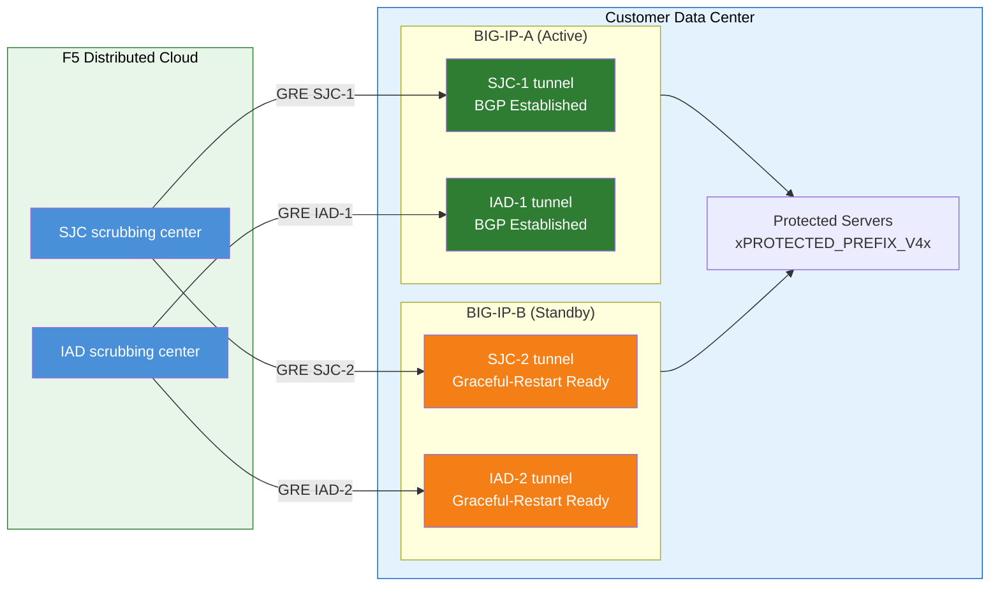

# BIG-IP HA Pair Considerations

If BIG-IP is deployed as an **active/standby HA pair**, each unit
gets its own independent GRE tunnels and BGP sessions to every
scrubbing center:

- **Independent tunnel endpoints**: Each BIG-IP unit has its own
  non-floating outer self IP (`traffic-group-local-only`) and its
  own set of GRE tunnels. BIG-IP-A uses `xBIGIP_A_OUTER_V4x` and
  BIG-IP-B uses `xBIGIP_B_OUTER_V4x` as tunnel endpoints. This avoids
  dependence on a floating IP for tunnel sourcing.
- **Independent BGP sessions**: Each unit runs its own BGP sessions
  over its own tunnels. BIG-IP-A peers with SJC-1 and IAD-1;
  BIG-IP-B peers with SJC-2 and IAD-2. On failover the standby
  unit's BGP sessions are already established, so F5 Distributed
  Cloud can shift traffic immediately.
- **Config sync**: Tunnel, self IP, and routing configurations are
  synced between units via **config-sync**. Because the `imish`
  BGP configuration is per-unit, each unit maintains its own
  neighbor statements. Verify sync includes all tmsh objects.
- **Active/standby BGP behavior**: The active unit advertises
  protected prefixes with normal BGP attributes. The standby unit
  can either advertise the same prefixes with a longer AS-path
  prepend (making it less preferred) or suppress advertisements
  until failover. Coordinate the approach with F5 SOC.
- **Failover convergence**: With `graceful-restart` enabled and
  independent tunnels, the new active unit already has established
  BGP sessions. Convergence depends on BGP best-path selection
  shifting to the newly active unit's advertisements. Test with
  `run sys failover standby`.

!!! note
    The independent-tunnel HA model above is the recommended approach
    for customer-side device redundancy. Validate your specific
    failover design with your F5 account team before going to
    production, particularly around AS-path prepend strategy and BGP
    reconvergence timing.

[xc-ddos-guide]: https://docs.cloud.f5.com/docs-v2/ddos-and-transit-services/how-tos/network-firewall/l3l4-ddos-mitigation
[k000147949]: https://my.f5.com/manage/s/article/K000147949
[gre-devcentral]: https://community.f5.com/kb/technicalarticles/configuring-a-generic-routing-encapsulation-gre-tunnel-using-big-ip/289030
[imish-docs]: https://techdocs.f5.com/kb/en-us/products/big-ip_ltm/manuals/product/big-ip-tmos-routing-administration-14-0-0/11.html
[rfc5082]: https://datatracker.ietf.org/doc/html/rfc5082
[rfc6164]: https://datatracker.ietf.org/doc/html/rfc6164
