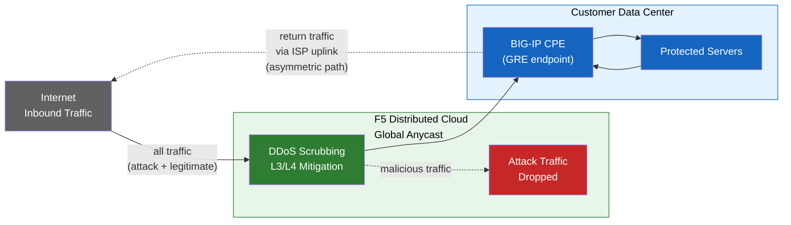

# F5 Distributed Cloud DDoS Mitigation (Routed Mode) with GRE and BGP from BIG-IP

## Purpose

This guide explains how to:

- Configure **GRE tunnels** and **BGP peering** from a BIG-IP HA pair
  (acting as customer premises equipment, CPE), with independent
  tunnels per unit.
- Connect to the **F5 Distributed Cloud DDoS Mitigation** scrubbing
  centers in **routed mode** (L3/L4).

If you are **not using BIG-IP for GRE tunnels**, use standard GRE
setup on your router/CPE, and follow the F5 Distributed Cloud guide
for tunnel and BGP configuration in the Console.

## Environment

- F5 Distributed Cloud **L3/L4 Routed DDoS Mitigation** service
  (Always On or Always Available) enabled for your tenant.
- BIG-IP with:
  - LTM (or equivalent networking modules).
  - **Dynamic routing (BGP)** licensed and enabled.
- Routed mode: at least one **publicly advertised /24 (or shorter)**
  prefix for protection (IPv6 minimum is **/48**).
  - Protected prefixes **must be publicly routable** (non-RFC 1918).
    GRE outer endpoints must also be publicly routable when tunnels
    traverse the public Internet; deployments using private
    connectivity (L2, private peering) may use RFC 1918 endpoint
    addresses.
- Connectivity between your data center/router and the F5 Distributed
  Cloud scrubbing center(s).

[xc-ddos-guide]: https://docs.cloud.f5.com/docs-v2/ddos-and-transit-services/how-tos/network-firewall/l3l4-ddos-mitigation
[k000147949]: https://my.f5.com/manage/s/article/K000147949
[gre-devcentral]: https://community.f5.com/kb/technicalarticles/configuring-a-generic-routing-encapsulation-gre-tunnel-using-big-ip/289030
[imish-docs]: https://techdocs.f5.com/kb/en-us/products/big-ip_ltm/manuals/product/big-ip-tmos-routing-administration-14-0-0/11.html
[rfc5082]: https://datatracker.ietf.org/doc/html/rfc5082
[rfc6164]: https://datatracker.ietf.org/doc/html/rfc6164
